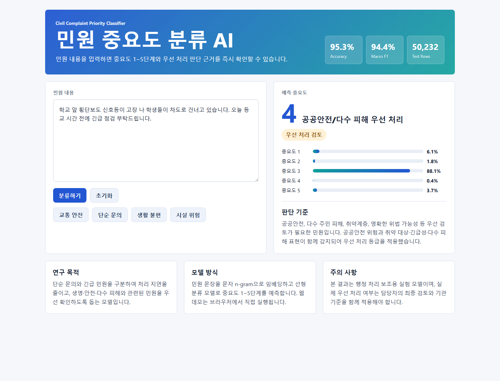
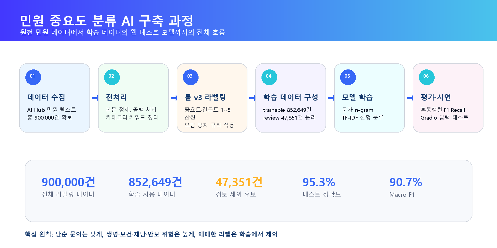
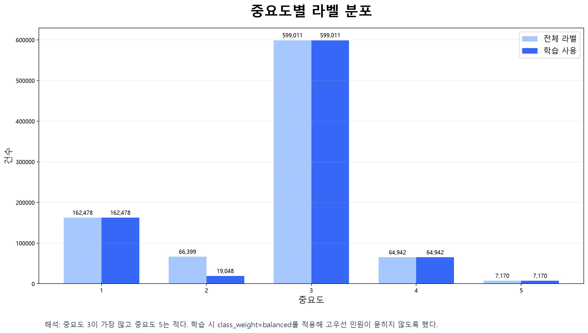
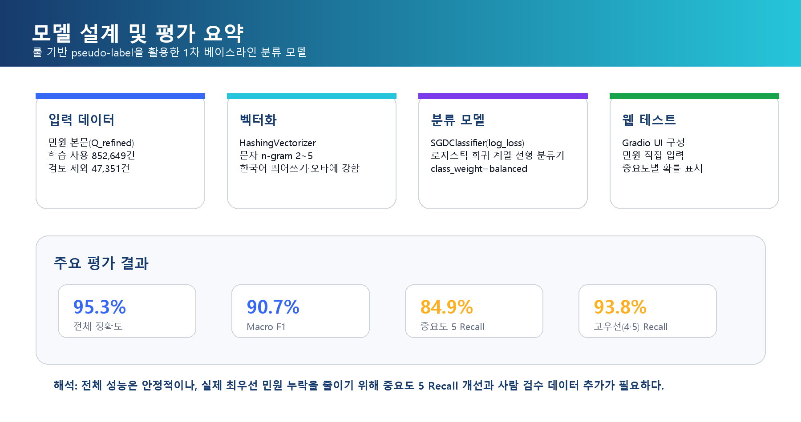
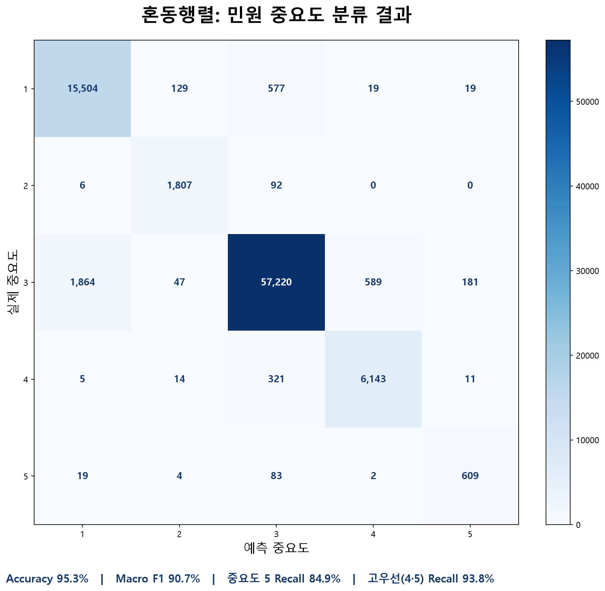

# 민원 중요도 분류 AI

민원 내용을 입력하면 중요도 1~5단계를 예측하고, 우선 처리 검토가 필요한 민원을 빠르게 확인하는 AI 프로젝트입니다.  
단순 문의와 긴급 민원이 같은 접수 흐름에 섞이면서 중요한 민원이 늦게 처리될 수 있다는 문제를 줄이는 것을 목표로 했습니다.

## 바로 실행

- 테스트 웹: [https://ehehdh.github.io/data-ml/](https://ehehdh.github.io/data-ml/)
- GitHub 저장소: [https://github.com/ehehdh/data-ml](https://github.com/ehehdh/data-ml)
- Colab 노트북: [Open in Colab](https://colab.research.google.com/github/ehehdh/data-ml/blob/main/notebooks/complaint_priority_train_colab.ipynb)
- 학습 데이터: [data/processed/rule_v3_trainable.csv.gz](data/processed/rule_v3_trainable.csv.gz)
- 검토 샘플: [data/sample/rule_v3_review_2500.csv](data/sample/rule_v3_review_2500.csv)

## 테스트 웹 화면



## 프로젝트 요약

이 프로젝트는 국민신문고·지방자치단체 민원 데이터의 문장을 분석하여 민원 중요도를 자동 분류하는 모델을 만드는 실험입니다.  
민원 처리 법령에는 중요도 1~5 같은 공식 우선순위 점수는 없기 때문에, 민원 처리 절차와 안전 관련 법령의 취지를 참고하여 자체 기준을 세웠습니다.

핵심 목표는 다음과 같습니다.

- 단순 문의와 실제 조치가 필요한 민원을 구분한다.
- 생명, 신체, 재난, 감염병, 안보 등 즉시 대응이 필요한 민원을 높은 등급으로 분류한다.
- 다수 주민 피해, 공공안전 위험, 취약계층 관련 민원을 우선 확인하도록 돕는다.
- 분류 결과를 Colab과 웹에서 직접 테스트할 수 있게 만든다.

## 전체 흐름



## 데이터 수집 및 전처리

AI Hub 민원 데이터를 기반으로 민원 문장, 분야, 하위 분야, 키워드, 관련 법령, 담당 부서 등의 컬럼을 정리했습니다.  
원천 데이터는 용량이 크기 때문에 GitHub에는 포함하지 않았고, 학습에 바로 사용할 수 있는 압축 데이터만 포함했습니다.

전처리 과정은 다음 순서로 진행했습니다.

- 원천 JSON/CSV 구조를 하나의 평면 CSV로 변환
- 민원 본문과 정제 문장을 기준으로 결측치와 짧은 문장 제거
- 유사 민원 군집화를 통해 반복 민원과 대표 샘플 확인
- 중요도·긴급도 라벨 생성
- 사람이 검토해야 할 애매한 데이터는 `needs_review`로 분리
- 학습 가능한 데이터는 `rule_v3_trainable.csv.gz`로 압축 저장

주요 파일은 다음과 같습니다.

```text
data/processed/rule_v3_trainable.csv.gz   Colab 학습용 압축 데이터
data/processed/rule_v3_report.json        라벨 분포 요약
data/sample/rule_v3_review_2500.csv       중요도별 500개 검토 샘플
scripts/pipeline.py                       데이터 정리/군집화/라벨링 파이프라인
```

## 라벨링 기준

중요도는 민원의 처리 우선순위를 나타내고, 긴급도는 지연될수록 피해가 커지는 정도를 나타냅니다.  
단순 위험 단어만 보고 높은 점수를 주면 오류가 많아지기 때문에, 실제 문맥에서 위험 대상, 피해 규모, 긴급 표현, 단순 문의 여부를 함께 확인하도록 기준을 세웠습니다.

| 중요도 | 의미 | 예시 |
| --- | --- | --- |
| 1 | 단순 문의·정보 확인 | 납부 방법 문의, 서류 발급 절차 질문 |
| 2 | 개인 불편 중심 일반 요청 | 개인 민원, 단일 불편 신고 |
| 3 | 구체 조치가 필요한 일반 민원 | 시설 보수, 행정 조치, 반복 불편 |
| 4 | 우선 검토가 필요한 공공안전·다수 피해 | 학교 주변 위험, 여러 세대 피해, 교통 안전 |
| 5 | 즉시 대응 가능성이 큰 중대 위험 | 생명·신체 위험, 화재, 붕괴, 감염병, 안보 |

기준 파일은 [config/importance_rubric.yaml](config/importance_rubric.yaml)에 정리되어 있습니다.

## 모델 설계

Colab 학습 모델은 한국어 민원 문장을 문자 n-gram으로 임베딩한 뒤 선형 분류 모델로 중요도 1~5단계를 예측합니다.  
웹 데모는 같은 계열의 경량 모델을 JSON으로 내보내 브라우저에서 바로 실행되도록 만들었습니다.

사용한 방식은 다음과 같습니다.

- 텍스트 표현: 문자 단위 n-gram
- 벡터화: Hashing Vectorizer + TF-IDF
- 분류기: SGDClassifier 기반 선형 분류 모델
- 평가: train/test split, classification report, confusion matrix
- 웹 배포: GitHub Pages 정적 웹, 브라우저 내 추론
- 안전 보정: 생명·재난·공공안전 표현은 모델 예측 후 규칙 기반으로 최소 등급 보정

## 학습 결과

웹 데모용 경량 모델 기준 성능은 다음과 같습니다.

- Accuracy: 약 95.3%
- Macro F1: 약 94.4%
- Test rows: 50,232건

라벨 분포와 평가 결과는 아래 인포그래픽으로 정리했습니다.







## 실행 방법

로컬에서 데이터 생성과 라벨링을 다시 실행하려면 다음 명령을 사용합니다.

```powershell
.\.venv\Scripts\python.exe scripts\pipeline.py flatten
.\.venv\Scripts\python.exe scripts\pipeline.py cluster
.\.venv\Scripts\python.exe scripts\pipeline.py rule-v3
```

웹 데모용 모델을 다시 만들려면 다음 명령을 사용합니다.

```powershell
.\.venv\Scripts\python.exe scripts\train_web_model.py
```

웹 데모를 로컬에서 확인하려면 다음 명령을 실행한 뒤 브라우저에서 표시된 주소를 엽니다.

```powershell
.\.venv\Scripts\python.exe -m http.server 8000 -d web
```

## 저장소 구조

```text
config/       중요도·긴급도 라벨링 기준
data/         제출용 압축 학습 데이터와 검토 샘플
docs/assets/  README 이미지와 인포그래픽
notebooks/    Colab 학습/평가/Gradio 테스트 노트북
scripts/      데이터 생성, 라벨링, 웹 모델 내보내기 코드
tests/        라벨링 기준과 파이프라인 검증 테스트
web/          GitHub Pages용 정적 웹 데모
outputs/      로컬 생성 산출물
```

## 한계 및 제언

이 모델은 실제 행정 처분을 자동 결정하는 시스템이 아니라, 담당자가 우선 확인할 민원을 찾도록 돕는 실험 모델입니다.  
라벨은 법률상 공식 우선순위가 아니라 연구 목적에 맞게 설계한 기준이므로, 실제 적용 전에는 기관 담당자 검토와 추가 데이터 검수가 필요합니다.

향후 개선 방향은 다음과 같습니다.

- 사람이 직접 검수한 고품질 라벨 추가
- KoELECTRA, KLUE-RoBERTa 같은 한국어 트랜스포머 모델과 성능 비교
- 중요도뿐 아니라 담당 부서 추천, 처리 유형 분류까지 확장
- 단순 키워드가 아니라 문맥을 더 잘 반영하는 라벨링 기준 개선
